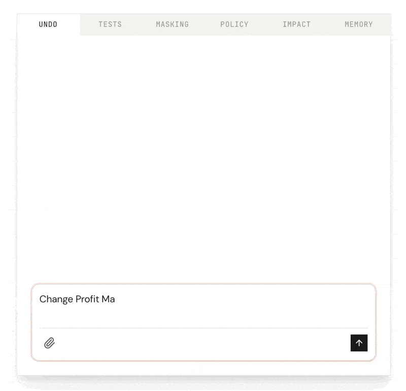

  

<h1 align="center" style="font-family: 'DM Sans', -apple-system, BlinkMacSystemFont, 'Segoe UI', sans-serif; font-weight: 600; letter-spacing: -0.011em;">SemanticOps MCP</h1>

Rollback mistakes. Test before deploy. Control what AI can change.

  

  

  
  
  

## Quick Links

- [**Full Documentation**](https://semanticops.dev) - Installation, guides, and examples
- [**Download Latest Release**](https://github.com/maxanatsko/mcp-engine-public/releases)
- [**Get Support**](https://semanticops.dev/faq) - FAQ and troubleshooting

## What It Does

SemanticOps MCP (formerly MCP Engine) is an MCP server that enables AI assistants (Claude, Copilot, ChatGPT) to read and modify Power BI Desktop files programmatically. Query your model, create measures, manage relationships, and optimize performance through natural language.

**[Learn more at semanticops.dev](https://semanticops.dev)** | **[View all features](https://semanticops.dev/features)**

## Privacy

This MCP server runs locally and collects zero telemetry. All data processing happens on your machine. Your AI assistant may send data to its provider (e.g., Anthropic, OpenAI) based on your interactions.

**[Read more in FAQ](https://semanticops.dev/faq#privacy)**

## Installation

Installation is straightforward and takes under 5 minutes.

**Requirements:** Windows 10/11, or MacOS platform

**[View installation guide](https://semanticops.dev/getting-started)**

Compatible with:

- Claude Desktop (Windows & macOS)
- Claude Code CLI (Windows & macOS)
- Visual Studio Code
- Any MCP-compatible client

---

## License

Proprietary license with permitted personal and commercial use.

**[View full license](https://semanticops.dev/license)** | **[Third-party notices](https://semanticops.dev/third-party-notices)**

## Author

Built by [Maxim Anatsko](https://maxanatsko.com) | Powered by [Model Context Protocol](https://modelcontextprotocol.io)

---

© 2025-2026 Maxim Anatsko. All rights reserved.
